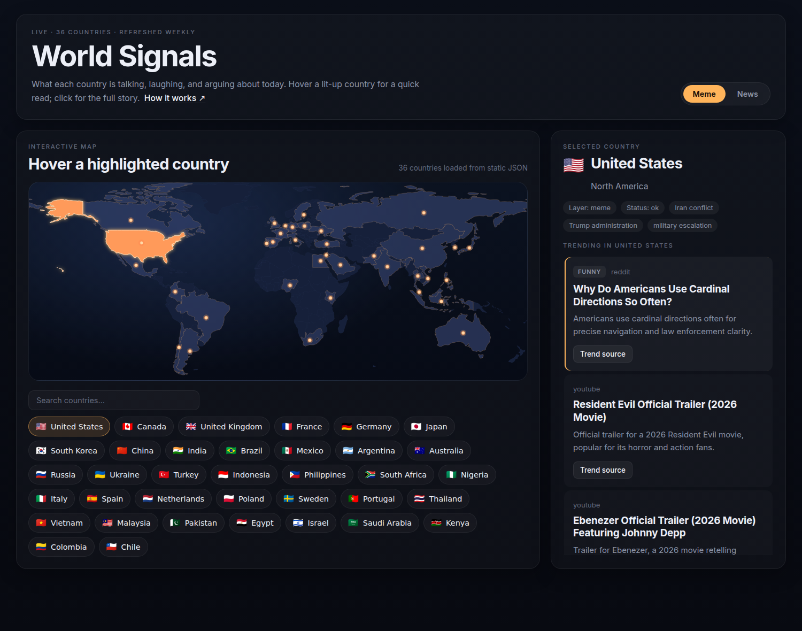
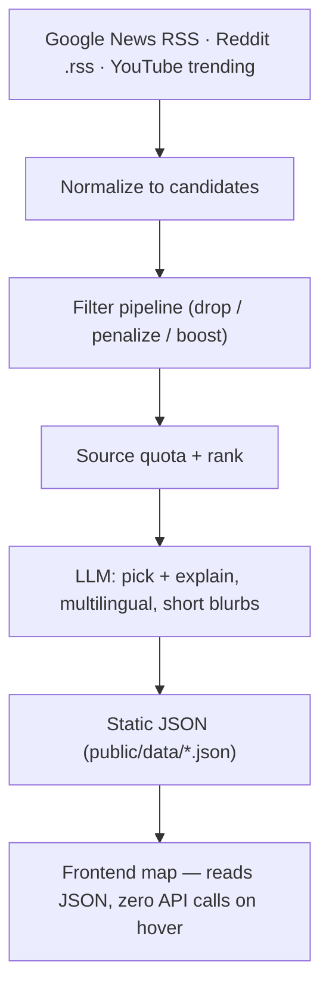

# World Signals

[](https://github.com/BartonHou/world_news/actions/workflows/tests.yml)

**A live map of what the world is talking, laughing, and arguing about.**

Hover any of 36 countries to see, for *today*: its top news story and a piece of
real internet culture (a Reddit thread or a trending YouTube video), each
explained for an outsider by an LLM.

🌍 **Live:** https://bartonhou.github.io/world_news/



---

## Why it exists

Most "world news" dashboards show you headlines. The interesting question is
softer: *what is a country's internet actually fixated on right now?* — the
joke, the drama, the thing everyone's sharing. That signal is much harder to
capture than news, so this project is built around capturing it well.

## What makes it interesting (the engineering)

The visible product is a map. The parts worth talking about are underneath:

- **Risk-first build order.** The hardest, most failure-prone part — turning raw
  web signals into a *shareable* culture card — was validated first with a
  throwaway CLI probe on 3 countries, before a single line of frontend. If that
  output wasn't fun, nothing else would matter.

- **"Trending searches ≠ internet culture."** The first version sourced the
  culture layer from Google Trends + Wikipedia pageviews and got back… news
  (stock indices, sports scores, breaking events). Those feeds are
  *news-driven*. The fix was to pull culture from where it actually lives:
  **Reddit country/culture subreddits + YouTube regional trending.**

- **Reddit against the grain.** Reddit's JSON endpoints are `403` for anonymous
  clients, but the `.rss` feeds still return `200`. They rate-limit hard
  (~20–30s recovery between hits), so requests go through a **global throttle**
  that spaces them out — and LLM latency between countries counts toward the
  interval, so the real run pays almost nothing extra. CI, whose datacenter IP
  gets blocked outright, uses read-only OAuth instead.

- **A pluggable filter pipeline, not vibes.** Before the LLM ever sees a
  candidate, rule-based filters `drop` / `penalize` / `boost` it (routine
  politics, sports scores, press releases, sticky/mod posts…). Every candidate
  carries a filter diagnostic so you can see *why* it was kept or buried. A
  small AI helper only fills semantic gaps (bare person-names, opaque
  multilingual titles), rather than owning the whole ranking.

- **Source quota for a balanced feed.** A per-source quota guarantees each
  country's card stream mixes Reddit (discussion / memes) and YouTube (what
  people are watching), instead of letting one source monopolize it.

- **Graceful degradation everywhere.** China has no YouTube trending (blocked)
  → it falls back to Reddit only. Reddit blocks a datacenter IP → the meme layer
  falls back to YouTube + news. A source erroring never breaks a country's card.

- **Tested where it counts.** The deterministic core — the filter pipeline,
  hard-drop behavior, the source quota, and LLM-response parsing — is pinned
  down by a network-free `pytest` suite that runs on every push (CI). The model
  and the network live at the edges; the logic that decides *what surfaces* is
  covered.

- **Cost lives in refresh, not requests.** Hovering never calls an API — the
  frontend only reads pre-generated static JSON, so traffic is free no matter
  how many people visit. The LLM only runs on a **weekly** refresh, which keeps
  the whole thing at roughly **$0.50/month (~$6/year)** on `gpt-4.1-mini`.

## Architecture



Refresh (`GitHub Actions`, weekly) runs the left side and redeploys the site.
The browser only ever touches the static JSON on the right.

## Data sources

| Layer | Source | Notes |
|-------|--------|-------|
| News | Google News RSS (per-country `hl`/`gl`/`ceid`) | free, no key |
| Culture | Reddit country/culture subreddits | free; anonymous RSS locally, read-only OAuth in CI |
| Culture | YouTube Data API v3 — regional `mostPopular` | free quota; ~1 unit/country |
| Fallback | Google Trends RSS, Wikipedia pageviews | used only when the above are thin |
| Summaries | OpenAI `gpt-4.1-mini` | selection + cross-cultural explanation |

## Tech

Vanilla JS + SVG (no framework) frontend rendering a real GeoJSON world map with
hover, country search, a news/meme layer toggle, and a scrollable card stream ·
Python data pipeline (`requests`, standard library) · GitHub Actions + GitHub
Pages for scheduled refresh and hosting. Zero backend, zero database — the
"API" is a folder of committed JSON.

## Run locally

```bash
pip install -r requirements.txt

# 1) generate data (needs API keys; ~25 min for all 36 countries)
python scripts/probe.py --output-dir outputs/phase0
python scripts/export_phase1_data.py

# 2) serve
python -m http.server 8766     # http://127.0.0.1:8766/
```

Faster iteration: `--country US --country JP` to limit scope, `--dry-run` to
skip the LLM and just inspect candidate fetching.

Run the tests (filter pipeline, source quota, parsers — all network-free):

```bash
pip install -r requirements-dev.txt
pytest -q
```

**Keys** come from env vars (or gitignored `key.txt` / `youtube_key.txt` /
`reddit_key.txt`):

- `OPENAI_API_KEY` — news/meme summarization
- `YOUTUBE_API_KEY` — YouTube Data API v3 (free quota)
- `REDDIT_CLIENT_ID` / `REDDIT_CLIENT_SECRET` — *optional* read-only Reddit app.
  Without them the probe falls back to Reddit's anonymous RSS feed, which works
  locally but is IP-blocked from datacenter/CI runners.

## Deployment

`.github/workflows/deploy.yml` refreshes the data weekly (Mondays 08:00 UTC),
rebuilds the JSON, and deploys the static site to GitHub Pages. It also deploys
on push (reusing committed data, no API cost). One-time setup: add the API keys
as Actions secrets (`OPENAI_API_KEY`, `YOUTUBE_API_KEY`, and — to keep Reddit
working from CI — `REDDIT_CLIENT_ID` / `REDDIT_CLIENT_SECRET`), and set
Pages → Source → *GitHub Actions*.

> Reddit IP-blocks datacenter runners for *anonymous* requests, so the pipeline
> uses read-only Reddit OAuth in CI. Without those two secrets it degrades
> gracefully to YouTube + news.

## Honest limitations

- **China** — Reddit is blocked there and there's no free API for Weibo /
  Bilibili / Douyin, so the CN card can't really represent Chinese internet
  culture. Known structural gap.
- **English-fronted subs** — JP and KR use native-language subs (`r/newsokur`,
  `r/hanguk`); the US leans on `r/AskAnAmerican` (discussion, not pure memes).
- **Image-only memes** — the LLM reads titles/text, not images, so a pure image
  post is marked low-confidence.

## Roadmap

- Mood layer (color the map by emotional tone)
- Time machine (weekly snapshots → "what was trending last week")
- More countries and native-language subs
- Privacy-friendly analytics
