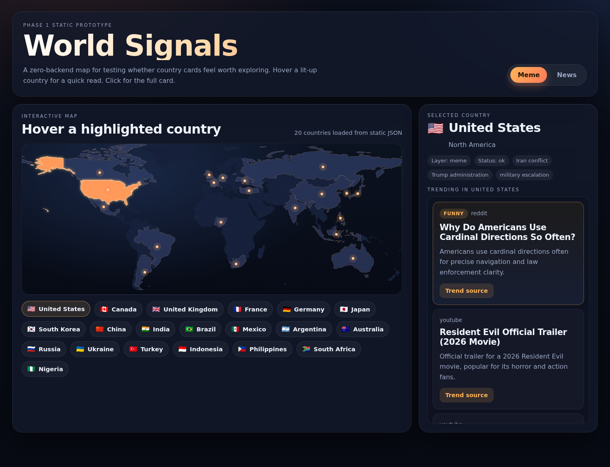
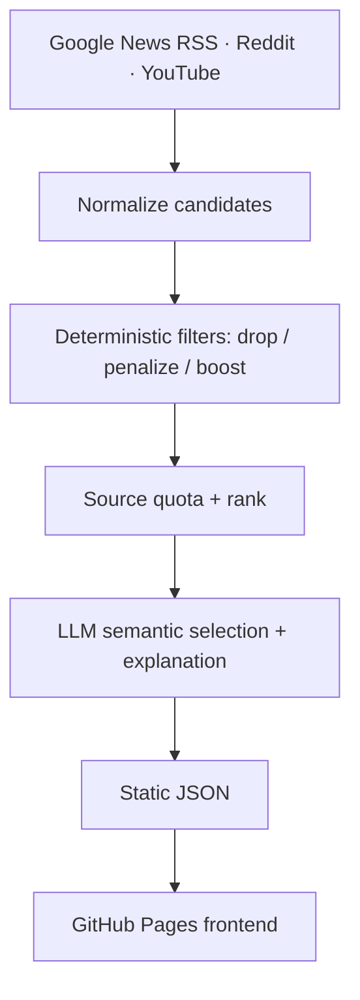

# World Signals

[](https://github.com/BartonHou/world_news/actions/workflows/tests.yml)

A static, globally browsable signal map that combines news, Reddit, and YouTube
into per-country snapshots.

**Live:** https://bartonhou.github.io/world_news/



## The engineering question

The visible product is a map, but the interesting problem is upstream:

> How do you combine noisy public web signals into something useful without
> handing the entire ranking problem to an LLM?

The pipeline therefore uses deterministic filtering and source balancing first,
then uses a language model only for semantic selection and explanation.

## Pipeline


```mermaid
flowchart TD
    A["Google News RSS · Reddit · YouTube"] --> B[Normalize candidates]
    B --> C["Deterministic filters: drop / penalize / boost"]
    C --> D[Source quota + rank]
    D --> E["LLM semantic selection + explanation"]
    E --> F["Static JSON"]
    F --> G["GitHub Pages frontend"]
```

The browser never calls the model or source APIs. All expensive work happens
during scheduled refreshes.

## Design choices

### Deterministic core before the LLM

Candidates are filtered with explicit rules before they reach the language
model. The rule layer can:

- hard-drop routine or low-value items,
- penalize weak candidates,
- boost useful candidates,
- record diagnostics explaining why a candidate moved.

This keeps important selection behavior inspectable and testable.

### Source quotas

Reddit and YouTube represent different kinds of attention. A source quota keeps
one source from monopolizing a country's culture feed.

### Graceful degradation

Each source can fail independently:

- Reddit can fall back to OAuth or be skipped if a datacenter IP is blocked.
- Countries without YouTube coverage can continue with other sources.
- A failed source does not prevent the rest of the country card from being built.

### Static serving

Generated data is committed as JSON and served by GitHub Pages. Hovering over a
country performs no API request and incurs no model cost.

## Testing

The deterministic core is covered by network-free pytest tests, including:

- filter behavior,
- hard-drop guarantees,
- source quotas,
- parsing of language-model responses.

```bash
pip install -r requirements-dev.txt
pytest -q
```

## Data sources

| Layer | Source |
|---|---|
| News | Google News RSS |
| Culture | Reddit country/culture communities |
| Culture | YouTube regional trending |
| Fallback | Google Trends / Wikipedia pageviews |
| Semantic layer | OpenAI model for selection and short explanations |

## Repository structure

- `scripts/` — ingestion, filtering, ranking, and export pipeline
- `public/data/` — generated static JSON
- `tests/` — network-free tests for deterministic logic
- `.github/workflows/` — scheduled refresh and Pages deployment
- `docs/hero.png` — project preview

## Run locally

```bash
pip install -r requirements.txt
python scripts/probe.py --output-dir outputs/phase0
python scripts/export_phase1_data.py
python -m http.server 8766
```

For faster iteration, restrict the pipeline to one or two countries or use its
dry-run path to inspect candidate fetching without the semantic layer.

## Limitations

This project does not claim to measure "national culture" objectively.

Important structural gaps remain:

- some countries have poor or blocked coverage on major public platforms,
- subreddit selection can bias toward English-speaking or expat communities,
- image-only memes are poorly represented by text-only signals,
- popularity on a platform is not the same thing as population-level attention.

Those limitations are part of the data-generating process and are intentionally
kept visible rather than hidden behind the LLM.

## Scope

World Signals is primarily a **data-pipeline and applied LLM systems project**.
Its strongest contribution is architectural: deterministic, auditable ranking
handles the decisions that should be testable, while the language model is
reserved for the semantic judgments that are difficult to encode with rules.
